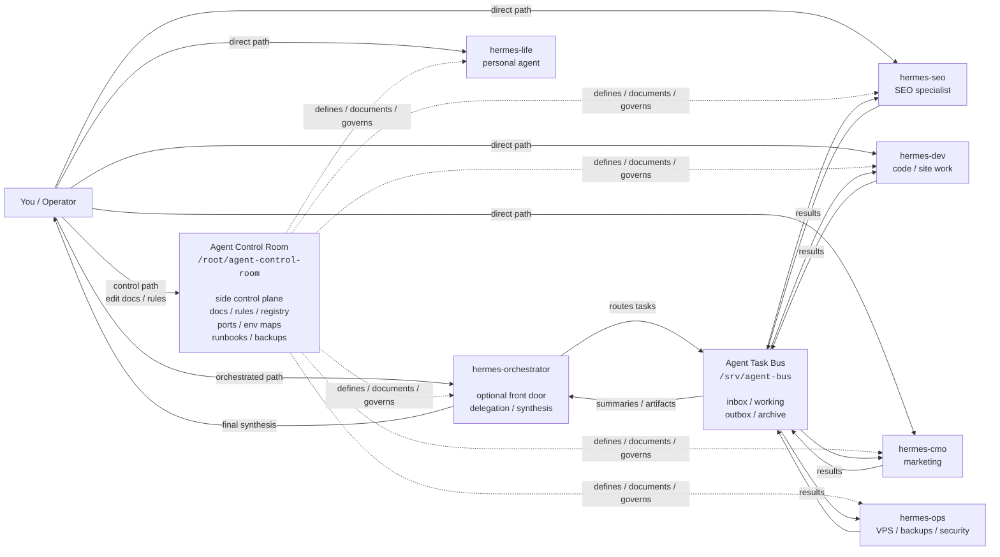

# Hermes Agent Control Room


A public template for setting up an **Agent Control Room** first, then scaling from one Hermes agent to direct specialists, orchestrated teams, and automated workflows.

The Agent Control Room is a sidecar repo/folder that documents and governs your Hermes agents. It is **not** an agent itself. It is the system map, operating manual, registry, runbook library, and recovery notebook for the agents you run.

It gives you a clean path from:

```text
one agent -> direct specialists -> orchestrator -> automated agent team
```

## About

Hermes Agent Control Room is a starter kit for people who want to run Hermes agents like an operating system instead of a pile of disconnected bots.

The repo gives you:

- A control-plane folder structure for documenting agents.
- Templates for agent runbooks, Docker notes, secret maps, and backups.
- A level-based architecture for growing from one agent to a specialist team.
- A task bus pattern for orchestrator-to-specialist delegation.
- Bundled setup and operations skills an agent can use to build or manage the system.

The key idea is simple: **set up the Control Room first, then plug agents into it.**

## Core Idea

```text
Create a VPS or choose an existing one.
Bootstrap the Agent Control Room.
Register one Hermes agent.
Add direct specialists when roles become clear.
Add an orchestrator when you want one front door.
Automate only after the manual system works.
```

The Control Room sits on the side as the control plane. You can use it directly, talk directly to any agent, or talk to an orchestrator that delegates to specialists.

```text
Agent Control Room = side control plane
Orchestrator       = optional manager/front-door agent
Specialists        = focused Hermes agents with role-specific tools
Task Bus           = handoff desk between orchestrator and specialists
You                = owner/operator with direct access to everything
```

## Full System Shape



## Access Paths

You are never locked into one workflow.

```text
Control path:
  You -> Agent Control Room

Direct path:
  You -> hermes-seo
  You -> hermes-dev
  You -> hermes-cmo

Orchestrated path:
  You -> hermes-orchestrator -> Agent Task Bus -> Specialists -> You
```

## Architecture Levels

### Level 1: Agent Control Room + One Agent

Set up the Control Room and register one Hermes agent.

Best for:

- One personal Hermes agent
- VPS setup documentation
- Docker migration planning
- Keeping runbooks and secret maps organized

You do not need an orchestrator or task bus yet.

### Level 2: Direct Specialist Agents

Add multiple role-specific Hermes agents and talk to them directly.

Examples:

- `hermes-life`
- `hermes-seo`
- `hermes-dev`
- `hermes-cmo`
- `hermes-ops`

The Control Room documents all of them. You choose which agent to talk to.

### Level 3: Orchestrator + Specialists

Add `hermes-orchestrator` as an optional front door. You can still talk directly to specialists, but the orchestrator can route and synthesize work.

The orchestrator follows the Control Room. It should not become a giant agent with every credential.

### Level 4: Automated Agent Team

Add recurring workflows, audits, backup checks, task routing, and optional direct gateway/API calls.

Only add automation after the manual workflow works.

## Bundled Skills

This repo includes skills that can be linked into Claude Code or adapted for Hermes.

```text
create-vps
  Create a fresh Hetzner VPS, SSH key, SSH alias, and local provisioning folder.

setup-control-room
  Bootstrap an SSH-accessible VPS with Node, Claude Code, Codex, Docker,
  Hermes Agent, and this Control Room template.

agent-control-room
  Manage the Control Room docs and agent folders.

agent-task-router
  Route tasks from an orchestrator to specialists through a task bus.

agent-registry-manager
  Maintain the agent registry.

agent-backup-manager
  Design and audit per-agent backups without committing secrets.

agent-security-auditor
  Check ports, dashboards, SSH, Docker, secret placement, and key scope.

agent-team-cron-planner
  Plan recurring multi-agent workflows after manual workflows work.
```

## Suggested Folder Structure

```text
agent-control-room/
  README.md
  agents/
    .gitkeep
  docs/
    architecture.md
    control-room-v1-operating-model.md
    levels.md
    naming.md
    security.md
    task-bus.md
    orchestrator.md
    starter-guide.md
  shared/
    api-keys-sop.md
    commands.md
    security.md
  templates/
    agent/
      inventory.md
      docker.md
      env-map.md
      runbook.md
      backup.md
    docker/
      docker-compose.agent.yml
      docker-compose.orchestrator.yml
    task-bus/
      agents.yaml
      task-template.md
      result-template.md
  skills/
    create-vps/
    setup-control-room/
    agent-control-room/
    agent-task-router/
    agent-registry-manager/
    agent-backup-manager/
    agent-security-auditor/
    agent-team-cron-planner/
  examples/
    level-1-control-room-one-agent/
    level-2-direct-specialists/
    level-3-orchestrator-specialists/
    level-4-automated-team/
```

## Setup

There are three ways to use this repo.

### Option A: Point An Agent At This Repo

This repo is designed to be agent-readable.

If your agent can read a GitHub repo or a local clone, point it here and ask:

```text
Read this repo and help me set up an Agent Control Room.
Start with docs/starter-guide.md and the setup-control-room skill.
```

If the bundled skills are available to the agent, you can be more direct:

```text
Use setup-control-room to bootstrap my VPS.
```

Or, if you need a new Hetzner server first:

```text
Use create-vps, then chain into setup-control-room.
```

The intended agent flow is:

```text
create-vps
  -> creates a Hetzner VPS, SSH key, and SSH alias

setup-control-room
  -> installs tooling and clones this repo onto the VPS

agent-control-room
  -> helps register and manage agents inside the Control Room
```

Important: the repo does not magically run code when opened. It gives your agent the setup instructions, templates, and skills. You still ask the agent to run the setup flow.

### Option B: Manual Setup On An Existing VPS

Use this if you already have an Ubuntu/Debian VPS you can SSH into.

SSH in:

```bash
ssh root@YOUR_SERVER
```

Clone the Control Room:

```bash
git clone https://github.com/shannhk/hermes-agent-control-room.git /root/agent-control-room
cd /root/agent-control-room
```

Read the starter guide and operating model:

```bash
cat docs/starter-guide.md
cat docs/control-room-v1-operating-model.md
```

Register your first agent:

```bash
mkdir -p agents/hermes-life
cp templates/agent/*.md agents/hermes-life/
```

Then fill in:

```text
agents/hermes-life/inventory.md
agents/hermes-life/docker.md
agents/hermes-life/env-map.md
agents/hermes-life/runbook.md
agents/hermes-life/backup.md
```

Keep raw secrets out of those files.

### Option C: Bootstrap With The Setup Skill

Use this if you have an SSH alias already configured locally.

The bundled `setup-control-room` skill is meant to:

- connect to your VPS over SSH
- install base packages
- install Node.js
- install Claude Code
- install Codex CLI
- install Docker
- install Hermes Agent best-effort
- clone this repo to `/root/agent-control-room`
- link bundled skills into `~/.claude/skills`

After it runs, SSH into the VPS and finish interactive auth:

```bash
ssh <alias>
claude /login
codex
hermes
```

Then start using the Control Room:

```bash
cd /root/agent-control-room
cat README.md
ls templates/agent/
ls skills/
```

### Recommended First Milestone

Do not start by building a whole agent team.

First milestone:

```text
1. Control Room exists on the VPS.
2. One agent is documented in agents/<agent-name>/.
3. No raw secrets are in the repo.
4. You can restart/debug/recover that one agent using its runbook.
```

Then move to Level 2 and add direct specialists.

## Runtime Split

Keep the control plane separate from live runtime state.

```text
/root/agent-control-room
  docs, templates, runbooks, registry, architecture
  no raw secrets

/srv/<agent-name>/data
  live Hermes runtime
  .env, memory, skills, sessions, crons, logs
```

## Security Rule

Never commit raw secrets.

The control room may record:

- secret names
- provider
- scope
- location
- rotation date

It must not record:

- API key values
- OAuth refresh tokens
- passwords
- private keys

## License

MIT. See `LICENSE`.
